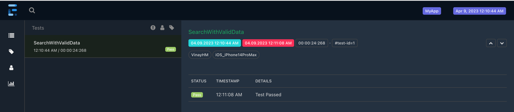

# appium-pageobjectmodel
Appium mobile test automation framework with Page Object Model design using Java + Maven + TestNG.
Framework follows many of the industry best practices and supports ios and can be scaled for android with minimun tweaks

Technologies/Tools used in building the framework
=================================================
- Intellij - IDE
- Appium - Mobile Automation library
- Maven - Build automation tool
- Java - Programming language
- TestNG - Test Management library
- Log4J - Logging framework
- Extent Reports - Reporting framework
- PropertyFile and TestNG.xml - Test Data
- GitHub - Version control

Framework implements below best practices
=========================================
- Code reusability
- Code readability
- Uses explicit waits
- Abstraction layer for UI commands like click, sendkeys, etc.
- Parameterization using TestNG XML and config.properties
- Exception handling [using Try/Catch and TestNG Listener]
- Supports iOS and it can be scalable for Android
- How to recover from test failure/ how to write fail safe test cases
- Scrolling for iOS and the same code works for Android as well
- Demonstrates how to effectively capture Screenshots
- Integrated with Log4J2 Logging framework (supports basic as well as parallel logging)
- Integrated with Extent Reporting framework (supports parallel, screenshots, logging test steps)

Prerequisites for Running Tests in local 
=========================================
- Developer Apple account
- Latest OSX version (I have built this framework on **MacOS Ventura 13.3** )
- Install home brew
- Install JDK and set JAVA_HOME
- Install latest Xcode v14.3
- Install Intellij
- Install Maven

- Install Node.js and npm using below command
  - brew install npm
  - To check if Node is installed, type in node -v  Terminal.
  
- Install Appium using below command (Appium 2.x is not bundled with iOS or Androiod browser so install them 
      seperately by using the command after install appium command )
  - npm install -g appium@next
  - appium driver install xcuitest (iOS Automation driver )
  - appium driver install uiautomator2 (Android Automation driver)
  
- Install Carthage using install command and run webpack command
  - npm install carthage
  - npm i -g webpack

- Install libimobiledevice
  - npm install libimobiledevice

- Install Authorize-ios
  - npm install -g authorize-ios
  
- Install ios-deploy
  - brew install ios-deploy

- Install Appium Doctor
  - npm install -g appium-doctor
  - Run appium-doctor to check if any installation errors
  
- Start Appium using below command
  - Appium

- Install WebDriver Agent using below steps
  - Navigate to the directory of the appium installed in terminal
  - Run the command "mkdir -p Resources/WebDriverAgent.bundle ./Scripts/bootstrap.sh -d" 
  - Open WebDriverAgent.xcodeproj project in Xcode in the directory where appium is installed and setup xcode for signing as mentioned below
    - WebDriverAgentLib and WebDriverAgentRunner > Signing and Capabilities > Click Automatically Manage signing
    - WebDriverAgentLib and WebDriverAgentRunner > Signing and Capabilities > Select Development Team
  - Launch Simulator from Developer Tools > Simulator
  - Run "xcrun simctl list devices booted" to get the device if
  - Navigate to appium-WebDriverAgent inside the appium directory and run below command to build WDA to simulator
    - xcodebuild -project WebDriverAgent.xcodeproj -scheme WebDriverAgentRunner -destination 'id=udid' test
  - Import the current framework as maven project and run mvn clean test inside the project folder where pom.xml is present
  - Right Click testng.xml > Run
  
- Once the test is completed extent reports is generated by the name Extent.html which provides the details report of the execution as mentioned below
  
  

  

